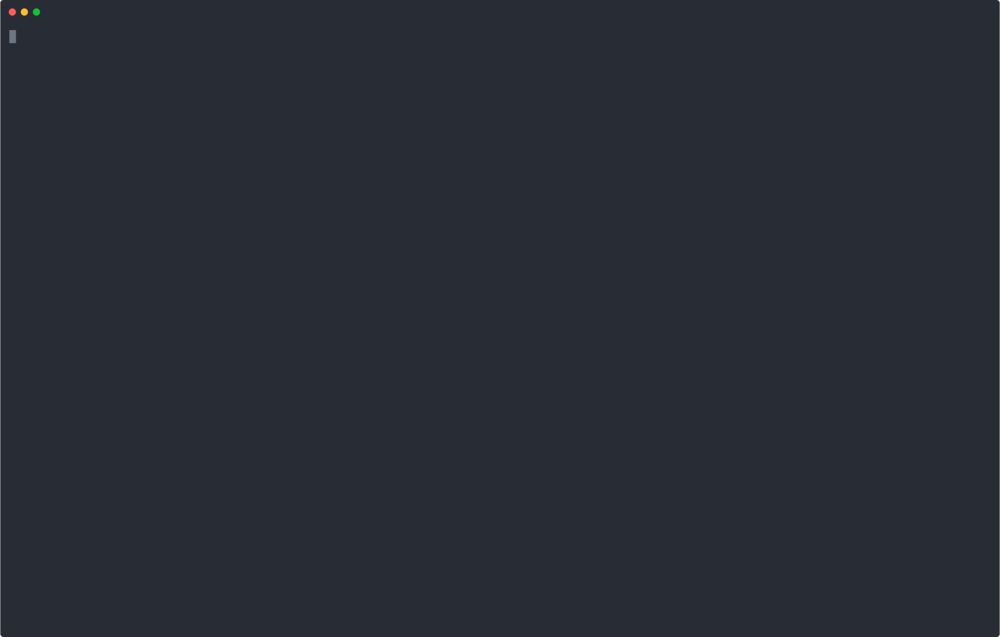

```
██╗ ██████╗ ███████╗██████╗ ███████╗██╗   ██╗  ███████╗██╗  ██╗
██║██╔═══██╗██╔════╝██╔══██╗██╔════╝██║   ██║  ██╔════╝██║  ██║
██║██║   ██║███████╗██║  ██║█████╗  ██║   ██║  ███████╗███████║
██║██║   ██║╚════██║██║  ██║██╔══╝  ╚██╗ ██╔╝  ╚════██║██╔══██║
██║╚██████╔╝███████║██████╔╝███████╗ ╚████╔╝██╗███████║██║  ██║
╚═╝ ╚═════╝ ╚══════╝╚═════╝ ╚══════╝  ╚═══╝ ╚═╝╚══════╝╚═╝  ╚═╝
```

A shell script that bootstraps iOS development environments.



## How It Works

`iosdev.sh` combines a variety of different tools into one script:
- [Homebrew](https://github.com/Homebrew/brew) (to install packages)
- [xcodes](https://githu[b.com/RobotsAndPencils/xcodes) and [aria2](https://aria2.github.io/) (to download and manage Xcode versions)
- [ruby-install](https://github.com/postmodern/ruby-install) (to create ruby installations)

## Usage

```
Usage:
    iosdev.sh [options]

Arguments:
    --xcodes <comma separated list>
        List of Xcode versions to install
        e.g. iosdev.sh --xcodes 13.1,13.2 
    --purge-xcodes
        Purge installed Xcode versions that are not in the "--xcodes" list.
        This flag does nothing if "--xcodes" is not specified.
        e.g. assuming Xcode 12.5.1 is installed:
        ./iosdev.sh --xcodes 13.1,13.2 --purge-xcodes
        This will install Xcode 13.1 and 13.2 and purge Xcode 12.5.1.
    --active-xcode <version>
        Select the active Xcode version.
        This flag does nothing if "--xcodes" is not specified.
        e.g. iosdev.sh --xcodes 13.1,13.2 --active-xcode 13.1
    --no-color
        Disable color output.
    --experimental
        Enable experimental features. 
        This option is not recommended, as it may break the script or have an unexpected behavior.
        Current experimental features are:
            - M1 macs support
    --ruby-version <version>
        Specify the portable Ruby version to install.
        e.g. iosdev.sh --ruby-version 2.7.2
    --ruby-name <name>
        Specify the portable Ruby's folder name. Defaults to "ruby".
        This flag does nothing if "--ruby-version" is not specified.
        e.g. iosdev.sh --ruby-version 2.7.2 --ruby-name prettyruby
    --ruby-gems <comma separated list>
        Specify the Ruby gems to install into the portable ruby.
        This flag does nothing if "--ruby-version" is not specified.
        e.g. iosdev.sh --ruby-version 2.7.2 --ruby-gems fastlane,cocoapods:1.11.2
    --help
        Show this help
```

## Installation

### Manually

    curl -L https://raw.githubusercontent.com/Zi0P4tch0/iosdev.sh/master/iosdev.sh > /usr/local/bin/iosdev.sh
    chmod +x /usr/local/bin/iosdev.sh

## Examples

- Install Xcode 13.1 and 13.2 (beta), and discard other versions of Xcode:

```
iosdev.sh --xcodes 13.1,13.2 --purge-xcodes
```

- Install Xcode 13.2 and make it active:

```
iosdev.sh --xcodes 13.2 --active-xcode 13.2
```

- Install a local version of ruby 2.7.2

``` 
iosdev.sh --ruby-version 2.7.2       // output: ./ruby folder
source ./ruby_activate.sh            // to activate it
ruby_deactivate                      // to deactivate it
```

- Install a local version of ruby 2.4.10 named "vruby"

``` 
iosdev.sh --ruby-version 2.4.10 --ruby-name vruby // output: ./vruby folder
source ./vruby_activate.sh                        // to activate it
vruby_deactivate                                  // to deactivate it
```

- Install a local version of ruby 2.7.2 with the latest Fastlane and Cocoapods 1.11.2 gems

``` 
iosdev.sh --ruby-version 2.7.2 --ruby-gems fastlane,cocoapods:1.11.2       // output: ./ruby folder
source ./ruby_activate.sh                                                  // to activate it
ruby_deactivate                                                            // to deactivate it
```

- Deactivate colors

```
iosdev.sh [...] --no-color
```

## Automate

You can use `expect` combined with `--no-color` to automate the script.

A simple example would be:

```
#!/usr/local/bin/expect -f

set timeout -1
set password [lindex $argv 0]
spawn ./iosdev.sh --xcodes 13.1,13.2 --purge-xcodes --active-xcode 13.1 --no-color
match_max 100000

expect -exact "Do you want to continue? \[y/n\] "
send -- "y\r"
expect -exact "macOS User Password: "
send -- "$password\r"
expect eof
```

## Development

- Visual Studio Code + shellcheck extension

## License

Licensed under the MIT License.

```
MIT License

Copyright (c) 2021 Matteo Pacini

Permission is hereby granted, free of charge, to any person obtaining a copy
of this software and associated documentation files (the "Software"), to deal
in the Software without restriction, including without limitation the rights
to use, copy, modify, merge, publish, distribute, sublicense, and/or sell
copies of the Software, and to permit persons to whom the Software is
furnished to do so, subject to the following conditions:

The above copyright notice and this permission notice shall be included in all
copies or substantial portions of the Software.

THE SOFTWARE IS PROVIDED "AS IS", WITHOUT WARRANTY OF ANY KIND, EXPRESS OR
IMPLIED, INCLUDING BUT NOT LIMITED TO THE WARRANTIES OF MERCHANTABILITY,
FITNESS FOR A PARTICULAR PURPOSE AND NONINFRINGEMENT. IN NO EVENT SHALL THE
AUTHORS OR COPYRIGHT HOLDERS BE LIABLE FOR ANY CLAIM, DAMAGES OR OTHER
LIABILITY, WHETHER IN AN ACTION OF CONTRACT, TORT OR OTHERWISE, ARISING FROM,
OUT OF OR IN CONNECTION WITH THE SOFTWARE OR THE USE OR OTHER DEALINGS IN THE
SOFTWARE.
```